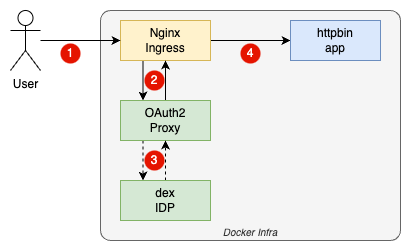

= OAuth2 Proxy Hands-on
:toc:

== Intro

=== What's this?

This is a local playground to explore the famous link:https://github.com/oauth2-proxy/oauth2-proxy[OAuth2 Proxy] project and its various configurations.

Hereby this hands-on project comes with a working OAuth2 human to machine flow, while the identity token is being forwarded to the back-end.

=== System level context

|===
| Step | Description

| 1
| The user tries to access a protected resource, in our case the front-end of the `httpbin` app.

| 2
| The `Nginx` ingress server intercepts the request and forwards it to `oauth2-proxy`.

| 3
a|
In case the user is not authenticated, `oauth2-proxy` redirected to the identity provider (DEX) for login.

If the user is already authenticated by the given security cookie, `oauth2-proxy` will redirect via `Nginx` reverse-proxy, to the app.

For cases where the back-end needs to read the ID token, `oauth2-proxy` is configured to decrypt the cookie and forward the token to the back-end via headers.

| 4
| The authenticated and authorized user finally can access the app.

|===

=== Prerequisites

* Docker
* direnv
* make

== Get started

* Clone this repo and setup the environment:
[source,bash]
----
make docker-infra-up
----
* Check status:
[source,bash]
----
make docker-infra-status
----
* Add needed localhost entries as described here: link:etc/docker-compose/local-env.yaml[local-env.yaml]
* Access link:http://httpbin.oauth2-proxy.localdev.me:5080[] and login: `admin`/`password`
* Now you should see the `httpbin` front-end - give it a try.

== Hints

=== Checking back-end request headers

To verify if configured headers are properly reaching the back-end, `httpbin` offers a handy endpoint to inspect. Just access link:http://httpbin.oauth2-proxy.localdev.me:5080/#/Request_inspection/get_headers[] and execute the query.

In the response body, you should see headers like `X-Access-Token` and `X-User`, being configured in link:etc/docker-compose/config/oauth2-proxy.cfg[oauth2-proxy.cfg] and link:etc/docker-compose/config/nginx.conf[nginx.conf].